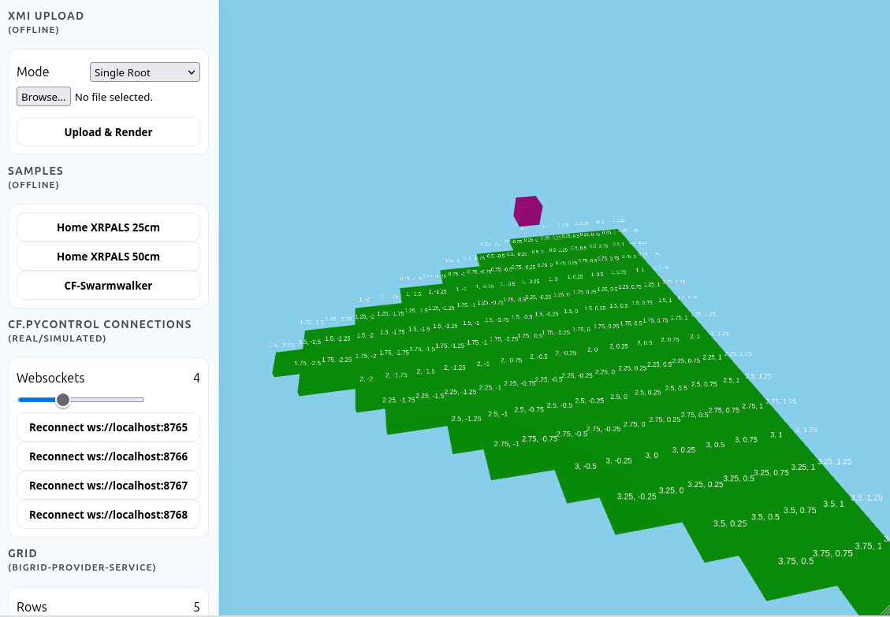
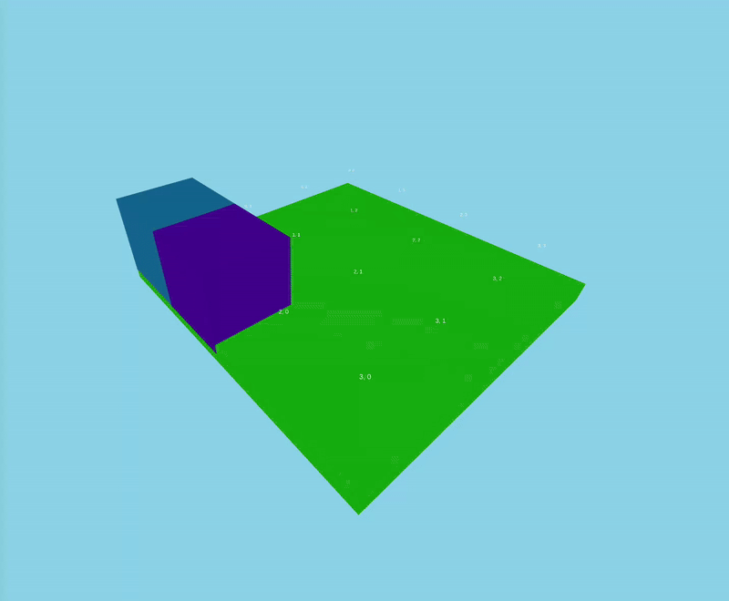

# Bi-Space Viewer

A web-based viewer for **bigrids** (bi-spatial structures).
It provides an interactive 3D environment for exploring and debugging bigrid models.

### Features

- **Bigrid Generation**
    - Load sample models
    - Upload custom XMI files
    - Generate grids via the `bigrid-provider-service`
    - Fetch from a CDO repository

- **Live Monitoring**
    - Visualize simulated or physical Crazyflie drone positions as a colored block
      (via [
      `cf.PyControl` WebSocket integration](https://github.com/UniAgent-CyberPhysicalAssets/cps.asset.crazyflie/tree/main/controller/cf.PyControl))

- **3D Navigation**
    - Free-flight camera

**Screenshots**

|||
|-|-|


## Getting Started

**Start the Web App:**

```shell
$ nvm install node --lts
$ nvm use --lts 
$ npm install
$ npm run dev
```

Open the browser at:
[`http://localhost:5173/`](http://localhost:5173/)

Press <kbd>ESC</kbd> to leave the 3D view and take back control.

### More Functions

- Start the [bigrid-provider-service](https://github.com/UniAgent-Platform/bigrid-provider-service) if you plan to
  generate grids dynamically.
- Start the CDO server if you want to load models from a CDO repository.
  See [here](https://github.com/bigraph-toolkit-suite/bigraphs-by-examples.vendingmachine-webservice/blob/main/src/test/java/org.example/CDOStandaloneServerTest.java)
  and [here](https://github.com/bigraph-toolkit-suite/bigraphs-by-examples.vendingmachine-webservice/blob/main/src/main/java/org/example/service/CDOServerService.java)
  for example.

If these services are not running, some features may be unavailable, but the application will still start and all
offline functionality will work normally.

### Configuration

**bigrid-provider-service**

- Change URL+Port: `vite.config.ts`

## How to Create Bigrids?

Use:

- [bigrid-provider-service](https://github.com/UniAgent-Platform/bigrid-provider-service)
- [bigraphs.model-provider](https://github.com/bigraph-toolkit-suite/bigraphs.model-provider)
- [Bigraph Framework](https://github.com/bigraph-toolkit-suite/bigraphs.bigraph-framework)
- [Bigellor](https://github.com/bigraph-toolkit-suite/bigraphs.ide.bigellor)

Create your own:
The [signature of bigrids](https://github.com/bigraph-toolkit-suite/bigraphs.model-provider/blob/main/src/main/java/org/bigraphs/model/provider/spatial/signature/BiSpaceSignatureProvider.java)
is very simple and their [usage](https://uniagent-cyberphysicalassets.github.io/cps.asset.crazyflie/31-drone-equations)
as well.
The file parsing logic lives in
[`BigraphGridXMLParser.js`](src/BigraphGridXMLParser.js).

## Dev-Notes

- The renderer supports two bigrid encodings:
    - **Single-root (1)**: all `Locale` elements share a single root.
    - **Multi-root (0)**: each `Locale` is attached to its own root.
    - Moreover, the coordinates can be encoded as "outer names" or as dedicated "CO-typed nodes" (coordinate nodes).
- The XMI parsing logic lives in
  [`BigraphGridXMLParser.js`](src/BigraphGridXMLParser.js).  
  It is self-contained and can be ported to other languages that need to read the same bigrid format (XMI).
- In the UI the appropriate parser is selected by passing the desired
  `version` to `fetchSampleAndRender(filename, version = 0 | 1)`.

## License

This Open Source software is released under the Apache 2.0 license.

---

Copyright © 2025 The UniAgent Developers and Contributors. <br/>
(Main Developer: Dominik Grzelak)